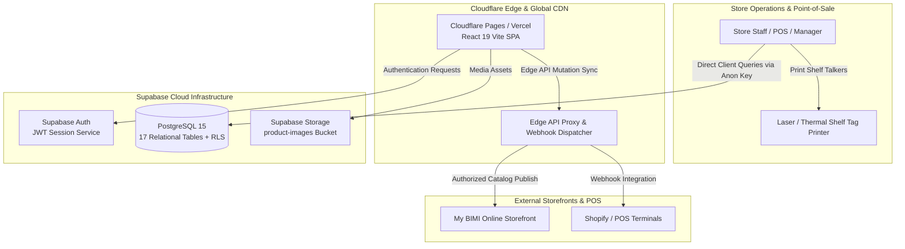

# PRODUCT STUDIO by My BIMI
### Next-Generation Japanese Retail Operations, Intelligent Shelf Tag Engine & Omnichannel Catalog Sync

  <b>安心・ハラール (Halal & Quality) · 新鮮で美味しい (Fresh & Delicious) · Good Food Better Life</b>
   
  Enterprise retail point-of-sale studio engineered specifically for <b>My BIMI HALAL 360 STORE</b> multi-branch supermarket operations in Tokyo, Japan.

---

## 🌟 Overview

**PRODUCT STUDIO by My BIMI** is an end-to-end retail management platform built from the ground up to solve complex Japanese supermarket merchandising workflows. It combines a millimeter-accurate **official shelf talker price tag printing studio**, **branch-specific pricing engines**, **multi-store inventory logistics**, and **omnichannel headless website synchronization**.

Developed and architected by **AHMED FAIYAZ** ([@stackahmedo](https://github.com/stackahmedo)).

---

## ✨ Key Features & Capabilities

### 🏷️ 1. Official Shelf Price Tag Studio (90mm × 65mm)
- **Millimeter-Accurate Physical Print Geometry**: Generates Japanese retail-standard 90mm × 65mm shelf talkers calibrated for 8 cards per A4 sheet (or 4 cards per A5).
- **Smart Dynamic Font Scaling**: Automatically scales long Japanese product titles (e.g. *新潟県魚沼産 コシヒカリ 特A 一等米 5kg*) to fit on 1 clean line without orphan line-breaks or colliding into price and weight fields.
- **Title Line Limit Modes**: Switch on-the-fly between **Auto-Fit (Smart)**, **Strict 1-Line (Mockup Standard)** with ellipsis (`…`) truncation, and **2-Lines Max (Multi-line)**.
- **Authentic Brand Design**: Faithfully renders the official My BIMI branding—emerald green ribbon (`#005A36`), crimson red prices (`#D6001C`), orange top accent (`#F25C05`), and diagonal slash footer.
- **Production Cutting Guides**: Features professional crop marks, center hairline crosshairs for paper guillotines, or dashed scissor guides.
- **Live Vector Barcodes & QR Codes**: Real-time JAN-13 barcode generation with modulo-10 checksum validation and product QR code embedding.
- **Dual Export Channels**: 1-click **Direct PDF Download** (`jspdf` + `html2canvas`) and native browser print dialog with page-break protection.

### 🏪 2. Multi-Store Branch Pricing Engine
- **Store-Specific Retail Overrides**: Independent pricing tables for flagship branches (*Shin-Koiwa Flagship Store*, *Yotsugi Branch*).
- **Japanese Consumption Tax Precision**: Automatic 8% reduced tax rate calculation for groceries and 10% standard rate, formatted with zero-decimal integer Yen precision.
- **Bulk Price Updates**: Batch update prices across selected categories or suppliers with instantaneous profit margin recalculation.

### 📦 3. Inventory & Inter-Store Stock Logistics
- **Multi-Branch Stock Matrix**: Real-time cross-store visibility for inventory levels, low-stock warnings, and reorder triggers.
- **Inter-Store Stock Transfers**: Transfer stock between stores with automated inventory decrements, increments, and movement audit logs.
- **Stock Take & Variance Tracking**: In-store counting reconciliations with shrinkage tracking.

### 🌐 4. Omnichannel Headless Website Sync
- **Catalog Synchronization**: Publish in-store product updates directly to external e-commerce storefronts (My BIMI Headless Online Store, Shopify, etc.).
- **Selective Field Sync**: Configure which product fields sync automatically (price, stock status, Japanese name, description, media).
- **Sync Audit Log**: Full HTTP response history, event tracking, and failure retry dispatching.

### 🔐 5. Role-Based Access Control (RBAC)
- Multi-tier staff permissions: `ADMIN`, `STORE_MANAGER`, `STORE_STAFF`, and `VIEWER`.
- Sensitive operations (cost prices, price overrides, catalog publishing) are protected behind role authentication guards.

---

## 🏛️ System Architecture

---

## 📚 Comprehensive Documentation

The repository includes complete engineering and deployment documentation inside the [`docs/`](./docs) directory:

| Document | Description |
| :--- | :--- |
| 🏛️ **[System Architecture](docs/SYSTEM_ARCHITECTURE.md)** | High-level architectural topology, layer breakdown, component interaction, and data flows. |
| 📐 **[System Design](docs/SYSTEM_DESIGN.md)** | Complete 17-table ERD schema, domain models, design patterns, and RBAC matrix. |
| 💻 **[Run Local Guide](docs/RUN_LOCAL_GUIDE.md)** | Quick start, npm scripts, demo accounts, feature walkthrough, and local troubleshooting. |
| ⚙️ **[Setup Guidelines](docs/SETUP_GUIDELINES.md)** | Environment variable matrix, Supabase provisioning, and PostgreSQL DDL execution. |
| ☁️ **[Cloudflare + Supabase Setup](docs/CLOUDFLARE_SUPABASE_SETUP.md)** | Cloudflare Pages deployment, Cloudflare Workers API proxy, custom domain DNS, and edge security. |
| ▲ **[Vercel + Supabase Setup](docs/VERCEL_SUPABASE_SETUP.md)** | Vercel deployment, official Supabase integration, environment variables, and SPA rewrites. |

---

## 📄 License & Copyright

Copyright © 2026 **My BIMI HALAL 360 STORE**. All rights reserved.  
Proprietary software designed for internal store operations, catalog management, and shelf merchandising.
