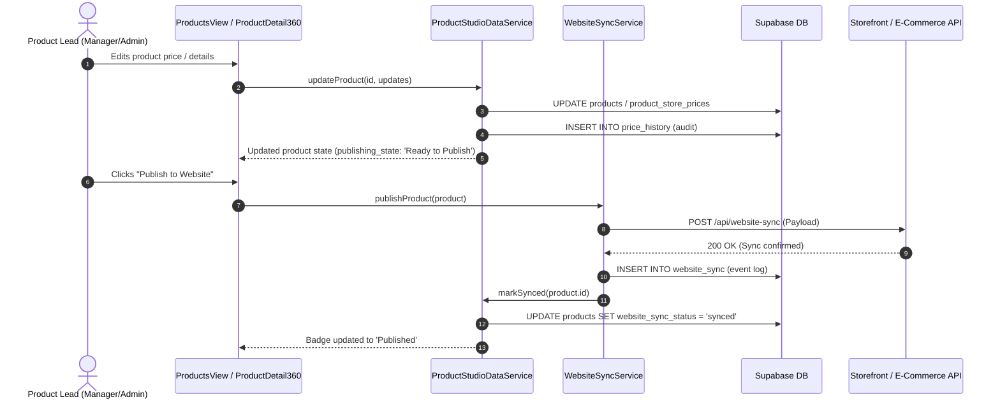
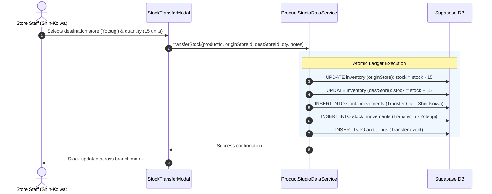

# System Architecture: PRODUCT STUDIO by My BIMI

**PRODUCT STUDIO by My BIMI** is an omnichannel Product Information Management (PIM), Multi-Store Inventory Hub, and Retail Operations Suite designed for **My BIMI**, an ethnic and halal supermarket retail chain operating in Japan (Tokyo region stores in Shin-Koiwa and Yotsugi, plus online e-commerce and mobile apps).

---

## 1. High-Level Architectural Diagram

```mermaid
flowchart TB
    subgraph ClientLayer [Client & Store Operation Layer]
        Staff[Store Staff / POS Terminal]
        Manager[Store Manager]
        Admin[System Administrator]
        Browser[Modern Web Browser - Desktop / Tablet]
    end

    subgraph EdgeCDN [Edge Network & CDN - Cloudflare]
        CF_Pages[Cloudflare Pages\nStatic SPA Hosting & Global CDN]
        CF_Worker[Cloudflare Worker\nEdge API Proxy & Webhook Router]
    end

    subgraph FrontendApp [Frontend Application - React 19 + Vite]
        UI[View Layer\nDashboard, Products, Inventory, Pricing, Tags]
        Context[State & Auth Context\nAuthContext (RBAC) + AppContext]
        DataService[ProductStudioDataService\nHybrid Cache & State Manager]
        SyncService[WebsiteSyncService\nE-Commerce Adapter Engine]
        LocalStorage[(Browser LocalStorage\nOffline & Standby Fallback)]
    end

    subgraph BackendLayer [Backend & Cloud Database - Supabase]
        SupaAuth[Supabase Auth\nJWT Session & Security]
        SupaPostgres[(PostgreSQL 15+\n17 Relational Tables + RLS)]
        SupaStorage[Supabase Storage\nProduct Image Assets]
    end

    subgraph ExternalChannels [Omnichannel E-Commerce & POS]
        BimiStore[My BIMI Online Storefront\nHeadless Next.js]
        ShopifyStore[Shopify Storefront\nWebhook Integration]
        POS[In-Store POS Terminals\nShin-Koiwa & Yotsugi]
    end

    ClientLayer --> Browser
    Browser --> CF_Pages
    CF_Pages --> FrontendApp
    
    DataService <--> LocalStorage
    FrontendApp <--> SupaAuth
    DataService <--> SupaPostgres
    
    FrontendApp --> CF_Worker
    CF_Worker <--> SupaPostgres
    CF_Worker <--> ExternalChannels
```

---

## 2. Layered Architecture Breakdown

### 2.1 Presentation Layer (Frontend UI)
- **Framework**: **React 19** (`19.0.1`) configured with **TypeScript** (`7.0.2`).
- **Styling**: **Tailwind CSS v4** (`@tailwindcss/vite`) utilizing custom design tokens for high-density retail data tables, responsive action drawers, and modal workflows.
- **Icons & Micro-Interactions**: **Lucide React** (`0.546.0`) and **Motion** (`12.23.24`) for smooth feedback during state transitions.
- **Physical Print Collateral Engine**: Built-in SVG barcode generator (`BarcodeSvg.tsx` supporting standard JAN-13 / EAN-13 symbology) and QR code generator (`QrCodeSvg.tsx`) with zero external canvas library latency.

### 2.2 Application State & Governance Layer
- **`AuthContext`**:
  - Implements **Role-Based Access Control (RBAC)** across 4 roles: `ADMIN`, `MANAGER`, `STORE_STAFF`, and `VIEWER`.
  - Integrates with Supabase Auth for token-based sessions and provides an instant one-click demo role switcher for auditing.
- **`AppContext`**:
  - Manages active branch location (`all` aggregate view vs. specific stores: `store-shin-koiwa`, `store-yotsugi`).
  - Global `Cmd+K` / `Ctrl+K` omni-search modal index.
  - Ephemeral toast notification queue.

### 2.3 Business Logic & Service Layer
- **`ProductStudioDataService` (`dataService.ts`)**:
  - Implements a **Hybrid Persistence Architecture**:
    1. Reads and writes against live **Supabase PostgreSQL** tables when network credentials are present.
    2. Gracefully falls back to browser **`localStorage`** seeded from `mockData.ts` if offline or during initial standby mode.
  - Implements transactional mutations: stock adjustments automatically write to both current branch inventory and the immutable `stock_movements` ledger.
- **`WebsiteSyncService` (`websiteSyncService.ts`)**:
  - Employs the **Adapter Pattern** to isolate external storefront APIs (`BimiHeadlessApiAdapter`, `ShopifyStorefrontAdapter`, and `SimulationAdapter`).
  - Supports field-level sync granular controls (e.g. selectively syncing price changes without overwriting marketing descriptions).

### 2.4 Cloud Database Layer (Supabase / PostgreSQL)
- **PostgreSQL 15+** relational architecture with 17 normalized entities.
- **UUID Primary Keys** using `uuid-ossp` / `gen_random_uuid()`.
- **Automated Timestamps**: PostgreSQL triggers updating `updated_at` on every row mutation.
- **Row-Level Security (RLS)**: Enforces table-level data protection matching the authenticated user's role.

### 2.5 Edge Infrastructure Layer (Cloudflare)
- **Cloudflare Pages**: Global edge hosting of the compiled Single Page Application (SPA) bundle with sub-second TTL and automatic SSL.
- **Cloudflare Workers**: Edge serverless proxy for handling server-to-server catalog webhooks, verifying JWT tokens via `@supabase/server`, and hiding privileged credentials (`SUPABASE_SECRET_KEY`) from client browser bundles.

---

## 3. Core Information & Data Flows

### 3.1 Catalog Publishing Flow


### 3.2 Inventory Transfer & Stock Ledger Flow


---

## 4. Key Architectural Decisions (ADR Summary)

| Decision | Rationale | Trade-offs Considered |
| :--- | :--- | :--- |
| **Hybrid Persistence (Supabase + LocalStorage)** | Retail staff cannot experience downtime during connectivity interruptions or initial staging demos. | Requires maintaining synchronization logic between client cache and database tables. |
| **Client-Side SVG Barcode Rendering** | Native SVG barcode rendering prevents external API roundtrips and guarantees crisp, vector-grade print quality for in-store shelf tags. | Limited to standard symbologies (JAN-13 / EAN-13, Code 128) which match Japanese retail standards. |
| **Multi-Tier RBAC in App Context** | Store staff must adjust inventory and print shelf tags without accessing wholesale supplier margins or system settings. | Permission checking logic must be duplicated both in client UI guards and PostgreSQL RLS. |
| **Adapter Pattern for Storefront Sync** | Decouples Product Studio from whether My BIMI runs on custom headless Next.js, Shopify, or a legacy ERP. | Adding new storefront types requires implementing the unified `WebsiteSyncAdapter` interface. |

---

## 5. Non-Functional Requirements & System Qualities

- **Fault Tolerance**: If Supabase credentials are missing or the network drops, the application falls back seamlessly to local storage without throwing unhandled exceptions.
- **Japanese Retail Localization**:
  - Full support for **JAN-13** standard barcodes with check digit validation.
  - Native handling of Japan's **Dual Consumption Tax** system (8% reduced rate for groceries/food vs. 10% standard rate).
  - JPY integer currency formatting (no floating-point cents).
- **Auditability**: Every change to product data, wholesale costs, store selling prices, and stock counts is recorded in immutable audit tables (`audit_logs`, `price_history`, `stock_movements`).
