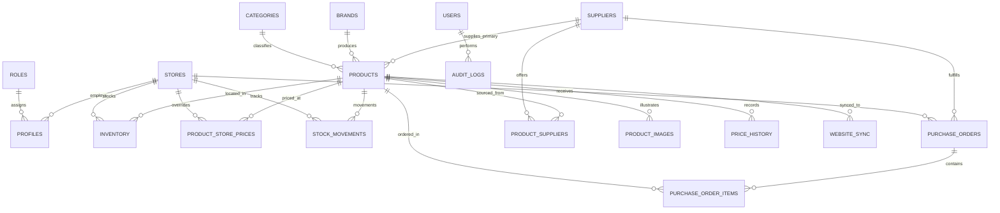
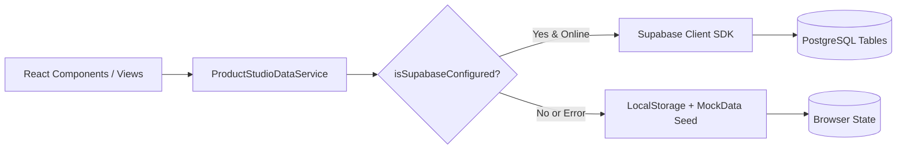

# System Design: PRODUCT STUDIO by My BIMI

This document specifies the software architecture, relational data model, design patterns, domain logic, and security design for **PRODUCT STUDIO by My BIMI**.

---

## 1. Entity-Relationship Diagram (ERD)

The database consists of **17 relational tables** normalized for high-integrity multi-store supermarket operations.



---

## 2. Relational Database Entities (17 Tables)

### 2.1 Core Master Entities

#### 1. `roles`
System access levels defining RBAC permissions.
- `id` (UUID, PK)
- `role_key` (`ADMIN` | `MANAGER` | `STORE_STAFF` | `VIEWER`, Unique)
- `title` (TEXT)
- `description` (TEXT)
- `permissions` (JSONB) - feature toggles map
- `created_at` (TIMESTAMPTZ)

#### 2. `stores`
Physical retail branches and distribution hubs.
- `id` (UUID, PK)
- `code` (VARCHAR(30), Unique) - e.g. `STORE-SHIN-KOIWA`, `STORE-YOTSUGI`
- `name` (TEXT) - Japanese and Romanized branch name
- `address` (TEXT), `phone` (VARCHAR(30)), `manager_name` (TEXT)
- `is_active` (BOOLEAN)
- `opened_at` (TIMESTAMPTZ), `created_at`, `updated_at`

#### 3. `profiles`
User profiles linked to Supabase authentication identity (`auth.users`).
- `id` (UUID, PK, FK ➔ `auth.users.id`)
- `email` (TEXT, Unique)
- `name` (TEXT)
- `role` (user_role_enum)
- `assigned_store_id` (UUID, Nullable, FK ➔ `stores.id`)
- `is_active` (BOOLEAN)
- `last_login_at` (TIMESTAMPTZ)

#### 4. `categories` & 5. `brands`
- `categories`: `id`, `name` (English), `name_ja` (Japanese), `slug`, `tax_rate` (0.08 or 0.10)
- `brands`: `id`, `name`, `country` (Country of brand origin)

#### 6. `suppliers`
Wholesale and import vendor master.
- `id` (UUID, PK), `code` (VARCHAR(30), Unique)
- `name` (TEXT) - Company legal name
- `contact_person` (TEXT), `phone`, `whatsapp`, `email`, `address`, `country`
- `payment_terms` (TEXT) - e.g., `Net 30`, `COD`, `Advance 50%`
- `currency` (VARCHAR(5)) - `JPY`, `USD`, `EUR`, `THB`, etc.
- `lead_time_days` (INTEGER) - Estimated procurement days
- `is_active` (BOOLEAN)

---

### 2.2 Product Catalog & Pricing Entities

#### 7. `products`
Central Product Information Management (PIM) record.
- `id` (UUID, PK), `sku` (VARCHAR(50), Unique), `barcode` (VARCHAR(50)) - JAN-13 / EAN-13
- `name` (TEXT - English), `name_ja` (TEXT - Japanese)
- `brand_id` (FK ➔ `brands.id`), `category_id` (FK ➔ `categories.id`), `subcategory` (TEXT)
- `description` (TEXT), `image_url` (TEXT), `country_of_origin` (TEXT)
- `weight_volume` (TEXT) - e.g. `500g`, `1L`, `24x330ml`
- `unit` (`pcs` | `kg` | `g` | `L` | `ml` | `pack` | `box`)
- `tax_rate` (NUMERIC(4,2)) - `0.08` (reduced rate) or `0.10` (standard rate)
- `cost_price` (NUMERIC(12,2)) - Base wholesale purchase cost in JPY
- **Landed Cost Breakdown**:
  - `freight_cost` (NUMERIC) - Freight / shipping cost per unit
  - `customs_duty` (NUMERIC) - Tariff / clearance fees per unit
  - `other_cost` (NUMERIC) - Inspection, cold-chain handling per unit
- `base_retail_price` (NUMERIC(12,2)) - Standard retail selling price (tax-exclusive)
- `min_stock_alert` (INTEGER), `reorder_level` (INTEGER)
- `status` (`Draft` | `Active` | `Out of Stock` | `Discontinued` | `Archived`)
- `halal_status` (`certified` | `muslim_friendly` | `not_applicable` | `non_halal`)
- `is_new_arrival`, `is_featured`, `is_bestseller` (BOOLEAN)
- `supplier_id` (FK ➔ `suppliers.id`)
- `publishing_state` (`Draft` | `Ready to Publish` | `Published` | `Sync Error` | `Unpublished`)
- `website_sync_status` (`synced` | `pending` | `error` | `disabled`)

#### 8. `product_images`
- `id` (UUID, PK), `product_id` (FK ➔ `products.id`), `image_url` (TEXT), `display_order` (INTEGER), `is_primary` (BOOLEAN)

#### 9. `product_store_prices`
Branch-specific selling and promotional price overrides.
- `id` (UUID, PK), `product_id` (FK ➔ `products.id`), `store_id` (FK ➔ `stores.id` or `'website'`)
- `regular_price` (NUMERIC(12,2))
- `offer_price` (NUMERIC(12,2), Nullable)
- `wholesale_price` (NUMERIC(12,2), Nullable) - For B2B / bulk buyers
- `tax_rate` (NUMERIC(4,2))
- `offer_start_date` (TIMESTAMPTZ), `offer_end_date` (TIMESTAMPTZ)
- `is_active` (BOOLEAN)

#### 10. `price_history`
Full audit ledger of all price revisions.
- `id` (UUID, PK), `product_id`, `store_id`, `old_price`, `new_price`, `cost_price`
- `old_margin_percent`, `new_margin_percent`
- `is_below_cost` (BOOLEAN) - Flagged if selling price drops below landed cost
- `reason` (TEXT), `effective_date`, `changed_by` (TEXT)

---

### 2.3 Inventory, Stock & Procurement Entities

#### 11. `inventory`
Store-level stock matrix.
- `id` (UUID, PK), `product_id` (FK ➔ `products.id`), `store_id` (FK ➔ `stores.id`)
- `stock_quantity` (INTEGER) - Available physical units
- `reserved_quantity` (INTEGER) - Held for online pickup or wholesale orders
- `shelf_location` (VARCHAR(50)) - e.g. `Aisle 2 - Shelf B`, `Chilled Section 3`
- `last_restocked_at` (TIMESTAMPTZ)

#### 12. `stock_movements`
Double-entry immutable stock ledger.
- `id` (UUID, PK), `product_id`, `store_id`
- `type` (`Stock In` | `Stock Out` | `Sale` | `Adjustment` | `Transfer In` | `Transfer Out` | `Damaged` | `Waste` | `Expired` | `Return`)
- `quantity_change` (INTEGER - signed, e.g. `-5` or `+50`)
- `previous_stock` (INTEGER), `new_stock` (INTEGER)
- `reference` (TEXT) - PO Number, Transfer ID, or Adjustment Authorization
- `notes` (TEXT), `performed_by` (TEXT), `created_at` (TIMESTAMPTZ)

#### 13. `product_suppliers` & 14. `purchase_orders` / 15. `purchase_order_items`
- Multi-supplier sourcing per SKU with MOQ, carton pack size, and lead time.
- Procurement workflow: `draft` ➔ `ordered` ➔ `partially_received` ➔ `received`.

---

### 2.4 Omnichannel Sync & Governance

#### 16. `website_sync`
Outbound synchronization logs for e-commerce and POS channels.
- `id` (UUID, PK), `product_id`, `channel`, `event_type`, `status`, `http_code`, `payload_summary`, `error_message`

#### 17. `audit_logs`
Field-level diff tracking for compliance and security auditing.
- `id` (UUID, PK), `entity_type`, `entity_id`, `action`, `user_name`, `user_role`, `diff` (JSONB: array of `{ field, before, after }`), `timestamp`

---

## 3. Core Software Design Patterns

### 3.1 Adapter Pattern: Website Sync Service
Located in [src/services/websiteSyncService.ts](file:///Users/ahmedfaiyaz/Downloads/MyBIMI/log_data/product-studio-by-my-bimi/src/services/websiteSyncService.ts).
Decouples catalog publishing from specific external API contracts.

```typescript
export interface WebsiteSyncAdapter {
  id: string;
  name: string;
  publish(payload: WebsiteSyncPayload): Promise<WebsiteSyncResponse>;
  update(payload: WebsiteSyncPayload): Promise<WebsiteSyncResponse>;
  unpublish(sku: string): Promise<WebsiteSyncResponse>;
  healthCheck(): Promise<{ ok: boolean; latencyMs: number; message: string }>;
}

// 1. My BIMI Headless Storefront REST Adapter
class BimiHeadlessApiAdapter implements WebsiteSyncAdapter { ... }

// 2. Shopify Webhook / Admin API Adapter
class ShopifyStorefrontAdapter implements WebsiteSyncAdapter { ... }

// 3. In-Browser Simulation Adapter (Offline & Testing)
class SimulationAdapter implements WebsiteSyncAdapter { ... }
```

### 3.2 Hybrid Repository Pattern: Data Service
Located in [src/services/dataService.ts](file:///Users/ahmedfaiyaz/Downloads/MyBIMI/log_data/product-studio-by-my-bimi/src/services/dataService.ts).
Provides unified access to business entities with automatic fallback between live Supabase queries and browser `localStorage`.



### 3.3 Provider Pattern: Context Architecture
- **`AuthProvider`**: Injects user session, calculated permissions, and demo account switching into the entire React component tree.
- **`AppProvider`**: Shares active store filter, search shortcuts, and toast messaging.

---

## 4. Role-Based Access Control (RBAC) Matrix

| Feature / Action | `ADMIN` | `MANAGER` | `STORE_STAFF` | `VIEWER` |
| :--- | :---: | :---: | :---: | :---: |
| **View Catalog & Stock** | ✅ | ✅ | ✅ | ✅ |
| **Create / Edit Products** | ✅ | ✅ | ❌ | ❌ |
| **Wholesale Landed Cost View** | ✅ | ✅ | ❌ | ❌ |
| **Store Selling Price Overrides** | ✅ | ✅ | ❌ | ❌ |
| **Stock Count Adjustment** | ✅ | ✅ | ✅ | ❌ |
| **Inter-Store Stock Transfers** | ✅ | ✅ | ✅ | ❌ |
| **Generate & Print Shelf Tags** | ✅ | ✅ | ✅ | ✅ |
| **Manage Wholesale Suppliers** | ✅ | ✅ | ❌ | ❌ |
| **Purchase Order Procurement** | ✅ | ✅ | ❌ | ❌ |
| **Publish to Online Storefront** | ✅ | ✅ | ❌ | ❌ |
| **Financial Analytics & Reports** | ✅ | ✅ | ❌ | ❌ |
| **User Administration** | ✅ | ❌ | ❌ | ❌ |
| **Database & System Settings** | ✅ | ❌ | ❌ | ❌ |

---

## 5. Japanese Retail Localization Logic

### 5.1 JAN-13 Barcode Calculation & Validation
Located in [src/components/common/BarcodeSvg.tsx](file:///Users/ahmedfaiyaz/Downloads/MyBIMI/log_data/product-studio-by-my-bimi/src/components/common/BarcodeSvg.tsx).
Standard 13-digit Japanese Article Number (JAN) check digit algorithm:
$$\text{Checksum} = \left( 10 - \left( \sum_{i=1}^{12} d_i \times [1 \text{ if odd, } 3 \text{ if even}] \pmod{10} \right) \right) \pmod{10}$$

### 5.2 Japanese Dual Consumption Tax Calculation
1. **Reduced Tax Rate (`8%`)**: Applied to food, edible groceries, and non-alcoholic beverages.
2. **Standard Tax Rate (`10%`)**: Applied to non-food items, household goods, alcohol, and packaging materials.

$$\text{Tax-Included Price} = \lfloor \text{Tax-Excluded Price} \times (1 + \text{tax\_rate}) \rfloor$$

### 5.3 Landed Cost (CIF) & Margin Protection
$$\text{Landed Cost} = \text{cost\_price} + \text{freight\_cost} + \text{customs\_duty} + \text{other\_cost}$$
$$\text{Gross Margin \%} = \frac{\text{retail\_price} - \text{Landed Cost}}{\text{retail\_price}} \times 100$$
The pricing engine warns users if selling prices produce a margin $< 15\%$ or fall below Landed Cost.

---

## 6. Shelf Price Tag & Talker Printing Engine

Located in [src/views/PriceTagsView.tsx](file:///Users/ahmedfaiyaz/Downloads/MyBIMI/log_data/product-studio-by-my-bimi/src/views/PriceTagsView.tsx).

- **Page Grid Configurations**:
  - **A4 (8 cards/page)**: 2 columns $\times$ 4 rows (standard grocery shelf label).
  - **A4 (4 cards/page)**: 2 columns $\times$ 2 rows (large promotion talker).
  - **A4 (12 cards/page)**: 3 columns $\times$ 4 rows (compact pegboard tag).
  - **A3 & A5 formats**: Supported via custom CSS `@media print` rules.
- **Card Elements**:
  - Japanese product title (`name_ja`) prominently featured with secondary English subtitle.
  - Tax-included bold price with tax-excluded breakdown in compliance with Japanese display laws (*Sogaku Hyoji*).
  - Live JAN-13 barcode + QR code pointing to online product nutritional/halal page.
  - Cut lines, shelf aisle location, and dynamic badges (*Special Offer*, *New Arrival*, *Clearance*).
