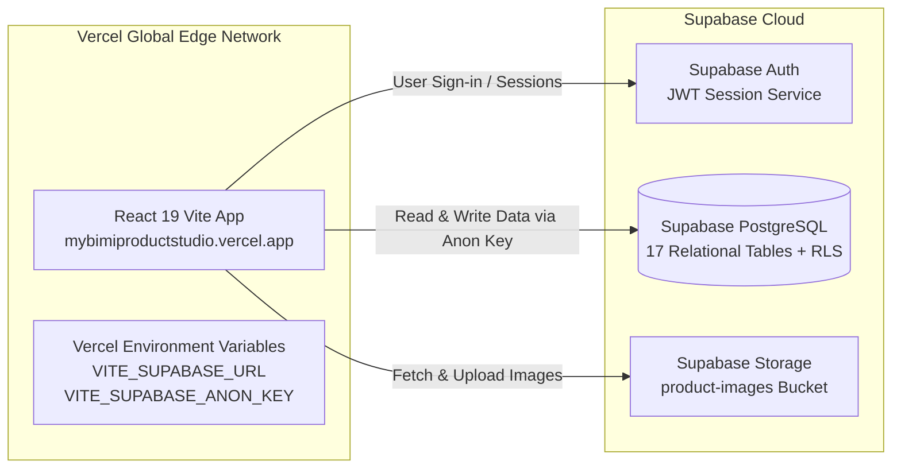

# Vercel + Supabase Setup Guide

This guide details how to deploy and connect **PRODUCT STUDIO by My BIMI** on **Vercel** with **Supabase**.

---

## 1. Quick Overview



---

## 2. Option A: Manual Setup (Recommended & Simplest)

### Step 1: Copy Credentials from Supabase
1. Log in to [Supabase Dashboard](https://supabase.com/dashboard) and open your project.
2. Go to **Project Settings** (gear icon) ➔ **API** (or **Data API**).
3. Copy:
   - **Project URL:** `https://<your-project-ref>.supabase.co`
   - **anon / public API key:** `eyJhbGciOi...` or `sb_publishable_...`

---

### Step 2: Import Project into Vercel
1. Log in to [Vercel Dashboard](https://vercel.com/dashboard).
2. Click **Add New...** ➔ **Project**.
3. Select your GitHub / GitLab repository.
4. In the **Configure Project** screen, Vercel will auto-detect **Vite**:
   - **Framework Preset:** `Vite`
   - **Build Command:** `npm run build`
   - **Output Directory:** `dist`
   - **Install Command:** `npm install`

---

### Step 3: Add Supabase Environment Variables in Vercel
Before clicking Deploy, expand the **Environment Variables** section and add:

| Key | Value | Description |
| :--- | :--- | :--- |
| `VITE_SUPABASE_URL` | `https://<your-project-ref>.supabase.co` | Supabase API endpoint |
| `VITE_SUPABASE_ANON_KEY` | `<your-anon-or-publishable-key>` | Public Anon Key |
| `VITE_SUPABASE_PUBLISHABLE_KEY` | `<your-anon-or-publishable-key>` | Alternate key name |

*(Make sure to select **Production**, **Preview**, and **Development** for each variable).*

Click **Deploy**.

---

## 3. Option B: Using the Official Supabase Vercel Integration

Vercel provides a 1-click integration with Supabase that automatically synchronizes your database credentials into Vercel environment variables:

1. In your project on [Vercel Dashboard](https://vercel.com/), go to the **Integrations** tab.
2. Search for **Supabase** and click **Add Integration**.
3. Select your Vercel team/account and choose your repository.
4. Select your **Supabase Organization** and **Project**.
5. The integration will automatically populate the required Supabase environment variables into Vercel.
6. Trigger a **Redeploy** to apply the new variables.

---

## 4. Option C: Deploy Directly via Terminal (Vercel CLI)

If you deploy from your local terminal:

```bash
# 1. Install Vercel CLI globally (if not already installed)
npm install -g vercel

# 2. Link your local project to Vercel
vercel link

# 3. Add environment variables to Vercel via CLI
vercel env add VITE_SUPABASE_URL
vercel env add VITE_SUPABASE_ANON_KEY

# 4. Deploy to production
vercel --prod
```

---

## 5. Configure Supabase Authentication Redirects

If your application uses Supabase Auth (email logins, password resets):
1. In the **Supabase Dashboard**, go to **Authentication** ➔ **URL Configuration**.
2. Set **Site URL** to your exact Vercel deployment URL:
   ```text
   https://mybimiproductstudio.vercel.app
   ```
   *(or your custom domain like `https://studio.mybimi.jp`)*
3. In **Redirect URLs**, add the allowed redirect paths:
   ```text
   https://mybimiproductstudio.vercel.app/**
   https://*.vercel.app/**
   http://localhost:3000/**
   ```
4. Click **Save**.

---

## 6. SPA Routing on Vercel (`vercel.json`)

To prevent HTTP 404 errors when refreshing inner pages (e.g. `/price-tags`, `/inventory`), the repository includes a `vercel.json` rewrite configuration:

```json
{
  "rewrites": [
    {
      "source": "/(.*)",
      "destination": "/index.html"
    }
  ]
}
```

This tells Vercel to route all subpaths back to `index.html` so the React Single Page Application handles the routing smoothly.

---

## 7. How to Verify Connection on Vercel

1. Open your live Vercel URL (e.g., `https://your-project.vercel.app`).
2. Look at the top-right header:
   - **Green Badge:** `Supabase Cloud Connected`
   - If it says `Local / Demo Mode (Offline)`, verify that the environment variables were saved and trigger a **Redeploy** in the Vercel Deployments tab.
3. Open Developer Tools (F12) ➔ **Network** tab:
   - Check API requests to `https://<your-project>.supabase.co/rest/v1/...`
   - You should see status `200 OK`.
